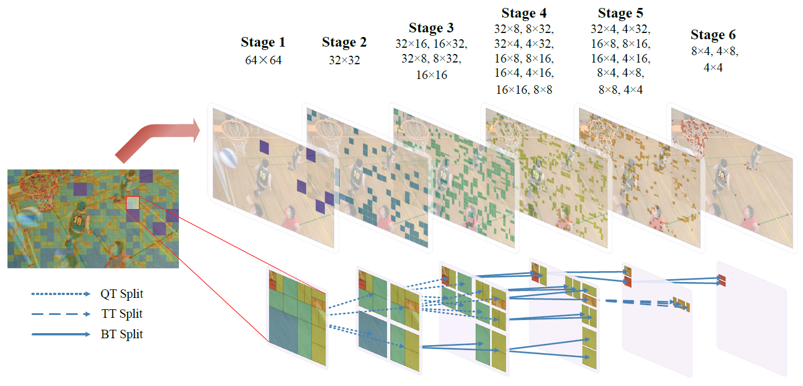
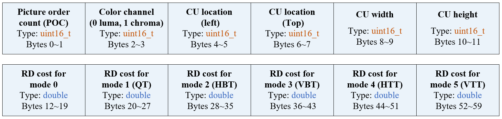

# CPIV-Database

A large-scale database for CU partition of intra-mode VVC (CPIV) [1].

## 1. Database Construction

This database is established from 204 raw video sequences and 8,000 raw images with multiple resolutions and diverse content. Among them, 182 training/validation sequences [2] [3] [4] and all 8,000 training/validation/test images [5] can be freely used for research without commercial purpose, which are uploaded here. Details about the sequences are listed in file *CPIV-Database.xlsx*, with the corresponding copyright files in folder *Copyright/*. All video sequences and images were encoded by the VVC reference software VTM-7.0 [6]. Here, four QPs \{22, 27, 32, 37\} were applied to encode them at the All-Intra (AI) configuration with the file *encoder\_intra\_vtm.cfg*. 

This CPIV database is composed of three parts: raw video/image data, CU partition labels and the RD cost for all existing CUs during the RDO search. Each label represents the ground-truth split mode for a CU, equal to one of six possible split modes, i.e., non-splitting (mode 0), quad-tree (mode 1), horizontal binary-tree (mode 2), vertical binary-tree (mode 3), horizontal ternary-tree (mode 4) and vertical ternary-tree (mode 5). In addition, the RD cost for all possible modes of each CU was recorded, which can be used for network training, in accord with the target of RD optimization in VVC. In total, this database contains the data from 6 million+ CTUs with 1 billion+ CUs, providing sufficient data for training the proposed MSE-CNN model. Also, they may facilitate the future research on VVC complexity reduction at intra-mode.

## 2. Download

From both Dropbox and BaiduNetDisk, files are the identical. Choose either site that is more convenient for you.

(1) 182 raw video sequences (in folder *YUV_HIF/*)

Dropbox: https://www.dropbox.com/sh/lpcmkkfcru6h5dy/AACsQWuI9nthIQIa5Tw4teFJa?dl=0

BaiduNetDisk: https://pan.baidu.com/s/10uVms2eHP9CIEhBke6dB5A#list/path=%2FHIF%20Database

(2) 8000 raw images

Dropbox: 

BaiduNetDisk: https://pan.baidu.com/s/1gHkFK9oM7ylIgb3a0mozdw  （code: xofq)

(3) Label and RD cost data:

They can be generated by the modified encoder *VTM-7.0_Exdata*. The executable file is in folder *VTM-7.0_Exdata\bin\vs16\msvc-19.23\x86_64\release* (Windows 10) or *VTM-7.0_Exdata\bin* (Linux). Here, *run.bat* or*run.sh* is an example to run the encoder. After encoding, a file *CUInfoCost.dat* is generated, which contains the data for CU partition and RD cost.

For convenience of use, all data files for 182 video sequences and 8000 images (named *CUInfoCost\*.dat*) will also be uploaded soon, within half a month.

## 3. Data Format

All data files (*CUInfoCost\*.dat*) are binary files. In a file, multiple records of CU information are sequentially stored. Each record is 60 bytes in length, with the format shown below.

For a file containing *N* record, the size of file is 60*N* bytes. An example is provided in *VTM-7.0_Exdata\bin\CUInfoCost.dat* (4,905 records, 294,300 bytes).

## References

[1] Tianyi Li, Mai Xu, Runzhi Tang, Ying Chen and Qunliang Xing, “DeepQTMT: A Deep Learning Approach for Fast QTMT-based CU Partition of Intra-mode VVC,” submitted to IEEE TIP, under review.

[2] Mai Xu, Xin Deng, Shengxi Li and Zulin Wang, “Region-of-Interest Based Conversational HEVC Coding with Hierarchical Perception Model of Face,” IEEE JSTSP, vol. 8, no. 3, pp. 475–489, Jun. 2014.

[3] Xiph.org, “Xiph.org Video Test Media,” https://media.xiph.org/video/derf, 2017.

[4] CDVL.org, “Consumer Digital Video Library,” https://www.cdvl.org, 2019.

[5] D.-T. Dang-Nguyen, C. Pasquini, V. Conotter, and G. Boato, “RAISE: A raw images dataset for digital image forensics,” in Proceedings of the 6th ACM Multimedia Systems Conference, 2015, pp. 219–224.

[6] Joint Video Experts Team (JVET), “VTM Software,” [Online]. Available: https://vcgit.hhi.fraunhofer.de/jvet/VVCSoftware\_VTM/, 2020, [Accessed 23-Feb.-2020].
